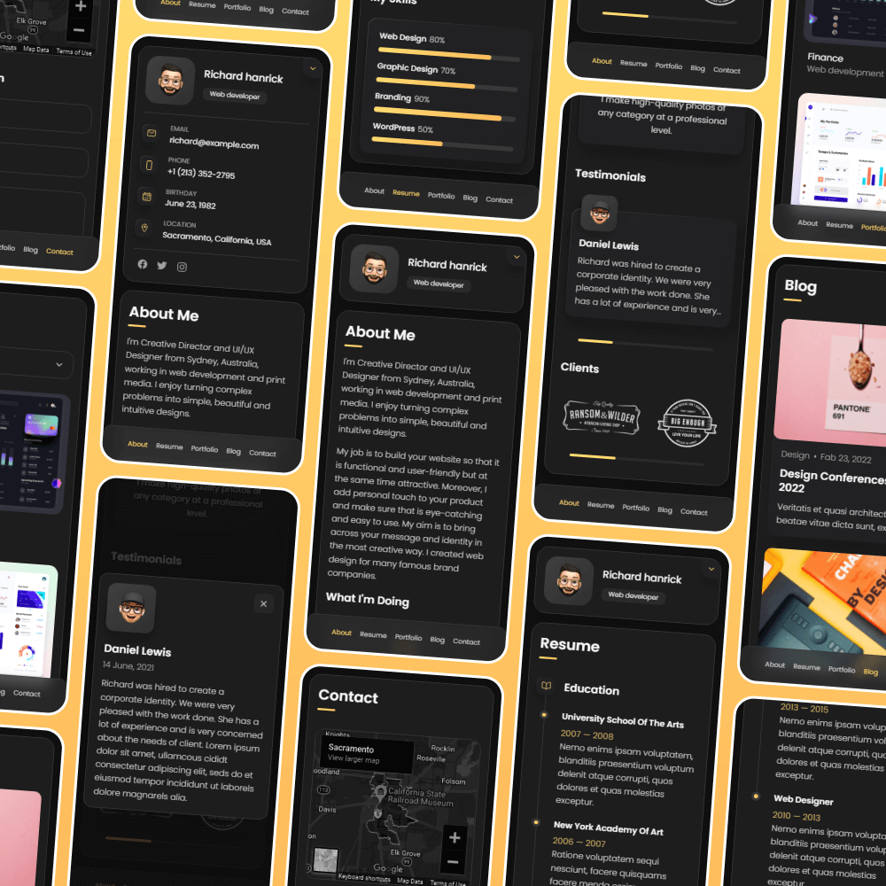

# vCard - Dynamic Personal Portfolio


vCard is a fully responsive personal portfolio website with **dynamic Markdown-based content management**. All content can be managed through simple Markdown files without touching HTML/CSS/JavaScript code.

## ✨ Features

- **📱 Fully Responsive** - Works perfectly on all devices
- **📝 Markdown-Based Content** - Manage all content through Markdown files
- **🚀 Dynamic Loading** - Content loads dynamically from Markdown files
- **📊 Blog System** - Add blog posts using Markdown files
- **💼 Portfolio Management** - Manage projects through Markdown files
- **🎥 Video Gallery** - YouTube video integration with thumbnails
- **📄 Resume Management** - Dynamic resume with timeline
- **🎨 Customizable** - Easy to customize and extend

## 📁 Project Structure

```
personal-webpage-master/
├── about.md              # About Me page content
├── resume.md             # Resume page content
├── contact.md            # Contact page content
├── blog/                 # Blog posts (Markdown files)
│   ├── 2024-01-15-web-development-trends.md
│   └── ...
├── portfolio/            # Portfolio projects (Markdown files)
│   ├── project-1.md
│   └── ...
├── videos/               # Video content (Markdown files)
│   ├── video-1.md
│   └── ...
├── assets/
│   ├── css/              # Stylesheets
│   ├── js/               # JavaScript files
│   └── images/           # Images and icons
└── index.html            # Main HTML file
```

## Demo




## Prerequisites

Before you begin, ensure you have met the following requirements:

* [Git](https://git-scm.com/downloads "Download Git") must be installed on your operating system.

## 🚀 Quick Start

### Installation

Linux and macOS:
```bash
git clone https://github.com/codewithsadee/vcard-personal-portfolio.git
cd vcard-personal-portfolio
```

Windows:
```bash
git clone https://github.com/codewithsadee/vcard-personal-portfolio.git
cd vcard-personal-portfolio
```

### Running Locally

```bash
# Using Python
python3 -m http.server 3000

# Or using Node.js (if you have serve installed)
npx serve . -l 3000
```

Then open `http://localhost:3000` in your browser.

## 📝 Content Management

### About Me Page (`about.md`)

Manage your About Me page by editing `about.md`:

```markdown
---
title: "About Me"
description: "Your description"
---

# About Me

Your introduction paragraph here.

## My Background

Your background information.

## What I'm Doing

### Web Design
Description of your web design services.

### Web Development
Description of your web development services.

### Mobile Apps
Description of your mobile app services.

### Photography
Description of your photography services.
```

**Adding New Services:**
- Just add a new `### Service Name` section in the "What I'm Doing" area
- The system automatically assigns appropriate icons based on keywords
- Icons are automatically assigned: Design/UI/UX → Design icon, Development/Coding → Dev icon, Mobile/App → App icon, Photo/Creative → Photo icon

### Blog Posts (`blog/` folder)

Create new blog posts by adding `.md` files to the `blog/` folder:

```markdown
---
title: "Your Blog Post Title"
date: "2024-01-15"
excerpt: "Brief description of your post"
---

# Your Blog Post Title

Your blog post content here...

## Subheading

More content...
```

### Portfolio Projects (`portfolio/` folder)

Add portfolio projects by creating `.md` files in the `portfolio/` folder:

```markdown
---
title: "Project Name"
date: "2024-01-15"
image: "./assets/images/project-1.jpg"
technologies: ["React", "Node.js", "MongoDB"]
---

# Project Name

Project description and details...
```

### Videos (`videos/` folder)

Add videos by creating `.md` files in the `videos/` folder:

```markdown
---
title: "Video Title"
date: "2024-01-15"
youtube_id: "VIDEO_ID_HERE"
description: "Video description"
---

# Video Title

Detailed description of the video content...
```

### Resume (`resume.md`)

Manage your resume by editing `resume.md`:

```markdown
---
title: "Your Name - Resume"
---

# Professional Summary

Your professional summary here.

## Work Experience

### Software Developer
**Company Name** | *2020 - Present*

- Key achievement 1
- Key achievement 2

### Junior Developer
**Previous Company** | *2018 - 2020*

- Key achievement 1

## Education

### Bachelor's Degree in Computer Science
**University Name** | *2014 - 2018*

- **GPA:** 3.8/4.0
- **Relevant Coursework:** Data Structures, Algorithms
```

## 🎨 Customization

### Adding Custom Icons for Services

If you want to use custom icons for specific services, edit `assets/js/about-parser.js` and add your service to the `customIcons` object:

```javascript
const customIcons = {
    'Web Design': './assets/images/icon-design.svg',
    'Your Custom Service': './assets/images/your-custom-icon.svg'
};
```

### Styling

- Edit `assets/css/style.css` for custom styling
- All content is dynamically loaded, so styling changes apply to all dynamically loaded content

## 📋 Content Guidelines

- **Blog Posts**: Use descriptive filenames with dates (e.g., `2024-01-15-my-post.md`)
- **Portfolio**: Include project images in `assets/images/` folder
- **Videos**: Use YouTube video IDs (the part after `v=` in YouTube URLs)
- **Resume**: Use proper Markdown formatting for timeline items
- **Services**: Service names automatically get appropriate icons based on keywords

## Contact

If you want to contact me you can reach me at [Twitter](https://www.twitter.com/codewithsadee).

## License

MIT
